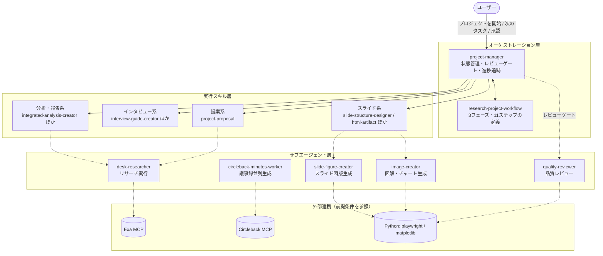
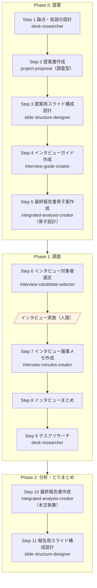
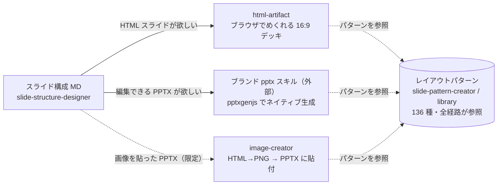

# Consulting Toolkit

コンサルティングプロジェクトの立ち上げから最終報告書の作成まで、ワークフロー全体をAIがサポートするスキル・コマンド・エージェント群。Claude Code のプラグインとして動作する。

調査プロジェクトでは、提案書の論点を軸にインタビューガイド・報告書骨子まで一貫して設計する。各スキルに品質基準が組み込まれており、AIタスクと人間タスクを明確に分離した協調型ワークフローで運用する。

## 全体像

project-manager がオーケストレーターとしてプロジェクトの状態を管理し、各ステップで実行スキルを呼び出す。重い処理（リサーチ・作図・品質レビュー）はサブエージェントに任せ、一部のスキルは外部の MCP コネクタやローカルツールと連携する。



---

## インストール

Claude Code のプラグインとしてインストールする。OS・環境を問わず動作し、更新も 1 コマンドで済む。

**手順**

1. Claude Code を開く
2. チャット欄に以下を1行ずつ入力する

```
/plugin marketplace add Dedekind-Tokyo/consulting-toolkit
```

```
/plugin install consulting-toolkit@consulting-toolkit
```

3. インストール完了。Skills / Agents / Commands が使えるようになる

コマンドを打たずに、`/plugin` だけを入力してプラグイン管理画面を開き、一覧から検索・インストールすることもできる。

**更新するとき**

```
/plugin update consulting-toolkit@consulting-toolkit
```

### 動作確認

インストール後、正しく認識されているか確認する。チャット欄で以下を実行:

```
/plugin list
/plugin validate
```

`consulting-toolkit` が表示されていれば OK。続けて「プロジェクトを開始」と入力し、project-manager が起動すればコア機能は動作している。

---

## 前提条件と外部連携のセットアップ

プラグインのコア機能（提案書・議事録・報告書などの文書生成、ワークフロー管理）は **Claude Code だけで動く**。以下の外部連携は、対応するスキル・機能を使うときに必要になる。未設定でも該当機能以外はそのまま使える。

### 依存関係一覧

| 依存 | 種別 | 必要になる場面 | 使うスキル / エージェント | 未設定時の挙動 |
|------|------|----------------|--------------------------|----------------|
| [Exa MCP](#exaセマンティック検索-推奨) | MCP コネクタ | デスクリサーチの質・網羅性を上げたいとき（推奨） | desk-research, desk-researcher | WebSearch / WebFetch のみで動作（英語ソース・類似事例探索が弱くなる） |
| [Circleback MCP](#circlebackai-議事録-circleback-meeting-minutes-利用時に必須) | SaaS + MCP コネクタ | Circleback の会議録画から議事録を一括生成するとき | circleback-meeting-minutes, circleback-minutes-worker | スキル自体が使えない（手動メモからの議事録は meeting-minutes-creator で可能） |
| [Python + Playwright ライブラリ](#python--playwright-ライブラリhtml--png--pdf-変換) | ローカル環境 | 図解・スライド図版を PNG 化するとき、quality-reviewer で HTML のレイアウト崩れを検証するとき | image-creator, slide-figure-creator, quality-reviewer | HTML→PNG / PDF 変換ができず、図版のクロップ検証・HTML のレンダリング検証がスキップされる |
| [matplotlib](#matplotlib-と日本語フォントデータチャート生成) | ローカル環境 | 実数値データのチャート（棒・レーダー・積み上げ等）を生成するとき | image-creator（chart-generator-guide 経由） | データチャート生成ができない |
| [LibreOffice](#libreofficepptx-のレンダリング検証) | ローカル環境 | quality-reviewer で PPTX のレイアウト崩れを検証するとき | quality-reviewer | PPTX のレンダリング検証がスキップされる |
| [Notion / Slack MCP](#notion--slack-mcp--任意) | MCP コネクタ | プロジェクト初期化時の連携リンク確認、Circleback 議事録の Notion 突合 | project-manager, circleback-meeting-minutes | 連携リンク欄が「なし」になるだけ。ワークフローは通常どおり進む |
| [Google Fonts への接続](#ネットワーク要件google-fonts) | ネットワーク | html-artifact の生成 HTML を意図どおりのフォントで表示するとき | html-artifact | システムフォントで代替表示される |
| [外部スキル（ブランド pptx 等）](#外部スキル--任意) | 別リポジトリのスキル | ネイティブ PPTX 納品、HTML の共有 URL 公開 | スライド化フローの下流 | 該当経路が使えないだけ。主経路（HTML デッキ）は動く |

### MCP コネクタ

#### Exa（セマンティック検索）— 推奨

`desk-research` スキルと `desk-researcher` エージェントは、[Exa](https://exa.ai/) のセマンティック検索 MCP（`web_search_exa` / `web_fetch_exa`）を **Layer 1 の主軸ツールの一つ** として利用する。Exa はキーワード一致ではなく意味で検索するため、技術文献・研究論文・GitHub / Stack Overflow・公式ドキュメント・「○○のような事例」型の類似探索・英語ソースに強く、WebSearch（最新ニュース・日本語メディア・公的統計に強い）と相互補完する。

**セットアップ**

| 方式 | 推奨度 | 手順 |
|------|--------|------|
| Claude のコネクタ経由 | ◎ | claude.ai の Settings → Connectors で Exa を追加し、Claude Code で `/mcp` を実行して有効化。API key 管理不要 |
| Exa API key を `.mcp.json` に設定 | ○ | カスタム制御が必要な場合。[Exa MCP ドキュメント](https://exa.ai/mcp) を参照 |

ツールの使い分け（Exa を選ぶ基準・WebSearch を選ぶ基準・併用パターン）は [desk-research/references/tool-selection.md](plugins/consulting-toolkit/skills/desk-research/references/tool-selection.md) を参照。

#### Circleback（AI 議事録）— circleback-meeting-minutes 利用時に必須

`circleback-meeting-minutes` スキルは、AI 議事録サービス [Circleback](https://circleback.ai/) が録画・文字起こしした会議を MCP 経由で取得し、議事録 MD を一括生成する。前提として **Circleback のアカウントがあり、対象の会議が Circleback で記録済み** であること。

**セットアップ（2 通り）**

1. **Claude コネクタ経由（claude.ai / デスクトップアプリ）**: Settings → Connectors → Browse connectors で「Circleback」を検索して追加する（[公式ガイド](https://support.circleback.ai/en/articles/13249081-circleback-mcp)）
2. **Claude Code（CLI）直接登録**: ターミナルで以下を実行し、セッション内で `/mcp` を実行して OAuth 認証を完了する

```bash
claude mcp add --transport http circleback https://circleback.ai/api/mcp
```

**接続確認**: チャットで「Circleback から先週の会議を検索して」と入力し、会議一覧が返れば接続できている。スキルは `SearchMeetings` / `ReadMeetings` / `GetTranscriptsForMeetings` の 3 ツールを使用する（ツール名のプレフィックスは環境ごとに異なるが、スキル側が自動解決する）。

#### Notion / Slack MCP — 任意

`project-manager` はプロジェクト初期化時に、Notion プロジェクトページと Slack チャンネルを検索して `workflow.md` の「連携リンク」節に記録する。また `circleback-meeting-minutes` は、生成した議事録を Notion のミーティング DB と突合できる。いずれも接続されていなければスキップされ、ワークフローは通常どおり進む。

**セットアップ**: claude.ai の Settings → Connectors で Notion / Slack を追加し、Claude Code で `/mcp` を実行して有効化する。

### ローカル環境（CLI・ライブラリ）

図解・チャート・レンダリング検証を使う場合は、Python 3 系（3.10 以上を推奨）と以下のライブラリをセットアップする。

#### Python + Playwright ライブラリ（HTML → PNG / PDF 変換）

`image-creator` と `slide-figure-creator` は、HTML+CSS で組んだ図解を同梱スクリプト [screenshot.py](plugins/consulting-toolkit/skills/image-generator-guide/scripts/screenshot.py) で PNG 化する（html-artifact のスライド図版もこのスクリプトでクロップ検証する）。`quality-reviewer` の提出前最終検査も、同スクリプトの `--pdf` モードで生成 HTML を print CSS 適用の PDF に変換し、レイアウト崩れ（はみ出し・見切れ・重なり）を確認する。

```bash
pip install playwright
python -m playwright install chromium
```

> HTML のレンダリング検証はこの Python スクリプトで完結する（Playwright MCP プラグインは不要）。スライドデッキは PDF 化すると `@media print` により 1 スライド 1 ページで展開されるため、デッキ全体を 1 ファイルで検証できる。

#### matplotlib と日本語フォント（データチャート生成）

実数値データのチャート（棒・レーダー・積み上げ等）は `chart-generator-guide` のテンプレートに従って matplotlib で描画する。

```bash
pip install matplotlib
```

日本語ラベルの文字化けを防ぐため、OS ごとに以下のフォントを `RENDER_FONT` に指定する（テンプレート内の設定値。詳細は [brand-palette-guide.md](plugins/consulting-toolkit/skills/chart-generator-guide/references/brand-palette-guide.md) を参照）。

| OS | フォント |
|----|----------|
| macOS | `"Hiragino Sans"`（標準搭載） |
| Windows | `"Meiryo UI"`（標準搭載） |
| Linux | `"Noto Sans CJK JP"`（`fonts-noto-cjk` 等でインストール） |

#### LibreOffice（PPTX のレンダリング検証）

`quality-reviewer` は PPTX の提出前検査で `soffice --headless --convert-to pdf` を使い、PDF 化したページでレイアウト崩れを確認する。

```bash
# macOS
brew install --cask libreoffice

# Ubuntu / Debian
sudo apt install libreoffice
```

### ネットワーク要件（Google Fonts）

`html-artifact` が生成する HTML は自己完結だが、フォントのみ Google Fonts（`fonts.googleapis.com` の Noto Sans JP / JetBrains Mono）を参照する。オフライン環境ではシステムフォントで代替表示され、字形がわずかに変わる（レイアウトは維持される）。

### 外部スキル — 任意

以下のスキルは本プラグインには同梱されていない。ドキュメント中で参照している連携はこれらがインストールされている場合のみ有効で、なくても各スキルの主機能はそのまま動作する。

| スキル | 参照元 | 用途 |
|--------|--------|------|
| ブランド pptx スキル（branded-pptx 等） | 編集できる PPTX を作るとき | pptxgenjs でネイティブに PPTX を生成（納品形式が PPTX のとき） |
| html-publish | html-artifact の下流 | 生成した HTML を共有 URL として公開する（作者の私的インフラ前提） |

---

## Skills

### プロジェクト管理

| スキル | 説明 | トリガー |
|--------|------|----------|
| [project-manager](plugins/consulting-toolkit/skills/project-manager/SKILL.md) | ワークフローのオーケストレーター。状態管理・進捗追跡を行い、各ステップで適切なスキルを呼び出す | 「プロジェクトを開始」「進捗確認」「次のタスク」 |

### 調査プロジェクト

デスクリサーチとインタビューを組み合わせた調査に対応する。技術動向調査、市場調査、インタビュー中心、デューデリジェンスなど幅広いプロジェクト種類をカバーする。

| スキル | 説明 | トリガー |
|--------|------|----------|
| [project-proposal](plugins/consulting-toolkit/skills/project-proposal/SKILL.md)（調査型） | 与件情報と打ち合わせメモから調査プロジェクト提案書を作成（冒頭のタイプ判定で調査型として実行） | 「調査提案書を作成して」「リサーチ提案書を作って」 |
| [interview-guide-creator](plugins/consulting-toolkit/skills/interview-guide-creator/SKILL.md) | 提案書の論点に対応したインタビューガイドを作成 | 「インタビューガイドを作成して」「質問リストを作って」 |
| [interview-candidate-selector](plugins/consulting-toolkit/skills/interview-candidate-selector/SKILL.md) | 候補者リストから最適なインタビュー対象者を選定・評価 | 「インタビュー対象者を選定して」「候補者を評価して」 |
| [interview-minutes-creator](plugins/consulting-toolkit/skills/interview-minutes-creator/SKILL.md) | 文字起こしと質問リストから詳細なインタビュー議事録を作成 | 「インタビュー議事録を作成して」「ヒアリング内容を整理して」 |
| [slide-structure-designer](plugins/consulting-toolkit/skills/slide-structure-designer/SKILL.md) | ソースドキュメントからスライドのページ構成をMDで設計。1スライド1メッセージのタイトル・メッセージ・ボディ3層構造で定義（レイアウトパターンの割付は実装側の html-artifact が行う） | 「スライド構成を設計して」「ページ構成を考えて」 |
| [integrated-analysis-creator](plugins/consulting-toolkit/skills/integrated-analysis-creator/SKILL.md) | 骨子設計・本文執筆・改訂の3モードで最終報告書を仕上げる。骨子設計（章立て）→ 統合分析による本文執筆（3層ピラミッド構造）→ 指摘ID管理による改訂・版管理・PPT転記までを1スキルでカバー | 「報告書骨子を作成して」「最終報告書を作成して」「統合分析して」「この指摘を反映して」 |
| [research-project-workflow](plugins/consulting-toolkit/skills/research-project-workflow/SKILL.md) | 3フェーズ・11ステップのワークフロー定義 | project-managerから自動呼び出し |

### 汎用プロジェクト

調査以外のプロジェクト（戦略策定、コンテンツ制作、システム実装、事業計画等）に対応する。

| スキル | 説明 | トリガー |
|--------|------|----------|
| [project-proposal](plugins/consulting-toolkit/skills/project-proposal/SKILL.md)（汎用型） | 与件情報から汎用プロジェクト提案書を作成（戦略・実装・コンテンツ等）。調査型と同一スキルで、冒頭のタイプ判定で分岐 | 「プロジェクト提案書を作成して」「提案書を作って」 |

### ユーティリティ

| スキル | 説明 | トリガー |
|--------|------|----------|
| [desk-research](plugins/consulting-toolkit/skills/desk-research/SKILL.md) | Exa（セマンティック検索）/ WebSearch / WebFetch / Browser Use / Deep Research プロンプトの3層で情報収集し、調査レポートを出力 | 「デスクリサーチを実行して」「初期調査をして」「市場規模を調べて」「競合調査して」 |
| [meeting-minutes-creator](plugins/consulting-toolkit/skills/meeting-minutes-creator/SKILL.md) | 会議メモから議事録を作成 | 「会議メモから議事録を作って」「打ち合わせの議事録を作成して」 |
| [chart-generator-guide](plugins/consulting-toolkit/skills/chart-generator-guide/SKILL.md) | matplotlibによるデータチャート生成ガイド。ブランドパレット対応、PNG+SVG二重出力。棒・レーダー・積み上げ等7パターンのテンプレート付き | image-creatorサブエージェント経由 |
| [image-generator-guide](plugins/consulting-toolkit/skills/image-generator-guide/SKILL.md) | HTML+CSSによる構造化図解の設計ガイド。イラスト・アート系は画像生成プロンプトを返却。image-creatorサブエージェントから読み込まれる | image-creatorサブエージェント経由 |
| [html-artifact](plugins/consulting-toolkit/skills/html-artifact/SKILL.md) | Markdown を、単体で開ける HTML（縦長の文書 / 16:9 スライドデッキ）に変換する。30 種のコンポーネントと 8 種の図解を内蔵し、スライドは第 2 層のレイアウトパターンに従って組む。生成のみ（HTML の公開は html-publish、PPTX 化はブランド pptx スキルへ） | 「HTML にして」「16:9 スライドにして」「ブラウザでめくれるプレゼンを作って」 |
| [slide-pattern-creator](plugins/consulting-toolkit/skills/slide-pattern-creator/SKILL.md) | スライド1枚のコンテンツエリア構造（レイアウトパターン）の正本。画像・PPTX からパターンを言語化した定義 MD ＋グレースケール・スケルトン HTML を生成し、`library/` に蓄積（同梱 136 パターン） | 「スライドパターンを抽出して」「SLIDE-PATTERN を生成して」 |
| [circleback-meeting-minutes](plugins/consulting-toolkit/skills/circleback-meeting-minutes/SKILL.md) | Circleback MCP から過去1週間の会議を取得し、プロジェクト関連を自動分類して議事録 MD を一括生成。複数件は並列処理（要 [Circleback セットアップ](#circlebackai-議事録-circleback-meeting-minutes-利用時に必須)） | 「Circlebackから議事録を作って」「先週の会議の議事録を作成して」 |

---

## Agents

特定の役割に特化したサブエージェント。project-managerやワークフローの各ステップから自動的に呼び出される。

| エージェント | 説明 | 呼び出しタイミング |
|-------------|------|-------------------|
| [quality-reviewer](plugins/consulting-toolkit/agents/quality-reviewer.md) | 成果物の品質レビュー専門。品質チェック項目と 5 軸（論理構造・具体性・読み手視点・整合性・網羅性）で評価し、合格 / 条件付き合格 / 要修正を判定する。提出前の最終検査では、出典の照合・NG 表現の点検に加え、HTML や PPTX を PDF 化してレイアウト崩れまで確認する（HTML は screenshot.py、PPTX は soffice を使用） | AIタスク完了後のレビューゲート（review_level=full のみ）、提出前最終検査モード（親エージェントがモードを指定して起動） |
| [desk-researcher](plugins/consulting-toolkit/agents/desk-researcher.md) | デスクトップリサーチ実行専門。Exa（セマンティック検索）/ WebSearch / WebFetch / Browser Use で情報を収集し、調査レポートと仮説検証シートを出力する | Step 1（論点・仮説の設計）、Step 9（デスクリサーチ） |
| [image-creator](plugins/consulting-toolkit/agents/image-creator.md) | 画像・図解・データチャートの生成。HTML+CSSで構造化図解をPNG化、matplotlibでデータチャートを生成。イラスト・アート系は画像生成プロンプトを返却 | 「画像にして」「図にして」「図解して」「グラフを作って」「データを可視化して」 |
| [circleback-minutes-worker](plugins/consulting-toolkit/agents/circleback-minutes-worker.md) | 親が `/tmp` に保存した単一会議のトランスクリプトから、meeting-minutes-creator / interview-minutes-creator に従って議事録 MD を生成する専門ワーカー | circleback-meeting-minutes スキルから並列起動 |
| [slide-figure-creator](plugins/consulting-toolkit/agents/slide-figure-creator.md) | html-artifact のスライドデッキで、図版を 1 図につき 1 エージェントで作る専門ワーカー。設計・描画・確認・修正を繰り返し、デッキに埋め込む HTML 断片を返す | html-artifact スキルから並列起動（Step 9.5・1 図ごと） |

---

## ワークフロー

project-manager は汎用オーケストレーターとして動作し、プロジェクト種類に応じたワークフロースキルにステップ実行を委譲する。状態管理・レビューゲート・進捗追跡は project-manager が担い、各ステップの具体的な手順はワークフロースキル側に定義する。

プロジェクトの状態は3ファイルで管理する:
- **CLAUDE.md**: 静的な基本情報（クライアント名・納期・ファイル配置）。全セッションで自動ロード
- **workflow.md**: プロセス進捗（チェックリスト・成果物リンク・履歴・重要な意思決定）
- **プロジェクトサマリ.md**: 知識状態（論点・仮説検証状況・リスク・主要発見事項）。プロジェクトルート直下に置き、初期化時にスケルトンを作成して以降随時更新する（`Output/` ではなくルート直下。CLAUDE.md・workflow.md と並ぶ状態管理ファイルのため）

与件の内容に応じて3つのパスでワークフローを決定する:

- **パスA**: 定義済みワークフローをそのまま使う
- **パスB**: 定義済みをベースにステップを追加・省略・順序変更
- **パスC**: AIが与件から新規設計する（定義済みを参照パターンとして使う）

### 定義済みワークフロー

| プロジェクト種類 | ワークフロースキル | 状態 |
|------------------|-------------------|------|
| 調査プロジェクト | [research-project-workflow](plugins/consulting-toolkit/skills/research-project-workflow/SKILL.md) | 実装済み |
| コンテンツ作成 | - | 将来追加 |
| 事業計画・戦略策定 | - | 将来追加 |
| ソフトウェア開発 | - | 将来追加 |

定義済みに合わないプロジェクトでは、AIが与件を分析してカスタムワークフローを設計する。カスタムで繰り返し使ったパターンは定義済みワークフローに昇格させる。追加手順は [project-manager/SKILL.md](plugins/consulting-toolkit/skills/project-manager/SKILL.md) の「新しいワークフロースキルの追加」を参照。

### 調査プロジェクトのワークフロー

3フェーズ・11ステップで構成される。技術動向調査、市場調査、インタビュー中心、デューデリジェンスに対応する。インタビュー実施のみ人間タスクで、それ以外はAIタスク（担当スキルを併記）。



各AIステップ完了後、レビューゲートを経て次へ進む。ステップごとに `review_level` が設定されており、`full` は quality-reviewer SubAgent + ユーザー確認、`light` はユーザー確認のみで進む。

### スライド化フロー（Step 3 / Step 11 の下流）

提案用（Step 3）・報告用（Step 11）で作ったスライド構成 MD は、そのまま渡せば HTML スライドや PPTX に変換できる（11 ステップの外側の任意工程）。

**欲しい出力ごとの作り方**

| 欲しいもの | 作り方 | 使うスキル |
|---|---|---|
| ブラウザでめくれる HTML スライド | 構成 MD をそのまま渡す | `html-artifact` |
| 編集できる PPTX（納品用） | 構成 MD をそのまま渡す | ブランド pptx スキル（外部・`branded-pptx` 等） |
| 画像を貼っただけの PPTX | HTML を PNG 化して PPTX に貼る | `image-creator` → PPTX |

**PPTX を作るなら、構成 MD からブランド pptx スキルで直接生成するのが主経路**。このスキルは pptxgenjs で編集可能な PPTX をそのまま生成する。「MD → HTML → PPTX」という経路はない。HTML（html-artifact）は PPTX の途中段階ではなく、ブラウザで見るための別形式である。画像を貼った PPTX（image-creator 経由）は、デザインを画像のまま持ち込みたいときだけの限定用途で、文字は編集できない。



**スキルを分けている理由 — 4 つの層**

スライド作りを 4 つの層に分けている。どの出力形式でも、同じ構成 MD と同じレイアウトパターンを使うため、経路を変えても見た目の骨格は揃う。

| 層 | 担当 | 役割 |
|---|---|---|
| 第 1 層 内容構成 | `slide-structure-designer` | 各スライドで何を言うか（タイトル / メッセージ / 本文）を MD で決める |
| 第 2 層 レイアウトパターン | `slide-pattern-creator` / `library` | スライドの中身をどう並べるか（136 種のパターン、**構造だけを定義**し色・線・余白などの見た目は持たない）。**レイアウト構造の正本はここ** |
| 第 3 層 スライドマスター | ブランド pptx スキル ／ html-artifact テーマ | 表紙・見出し行・フッター・色・フォントなど、全スライド共通の見た目 |
| 第 4 層 実装 | `html-artifact` ／ ブランド pptx ／ `image-creator` | 第 2 層のパターンと第 3 層のマスターに従って、実際のファイルを出力する |

- **レイアウト構造の正本は第 2 層（レイアウトパターン）**。html-artifact が持つコンポーネントや図解は「スライド 1 枚の中の部品や図の作り方」であって、スライド全体の並べ方は決めない。
- **見た目の決め方**：パターン（第 2 層）は「何をどこに置くか（構造）」だけを持ち、色・線・余白などの見た目は持たない。見た目は第 3 層のスライドマスター／テーマと、ボディ（コンテンツエリア）の最低保証ライン「ベースライン規範」（[`_shared/slide-body-principles.md`](plugins/consulting-toolkit/skills/_shared/slide-body-principles.md)）が決める。ベースライン規範は「1 枚に部品を詰め込みすぎない・面を入れ子にしない・強調は 1 箇所」といった床（＝最低保証ラインであって表現の上限ではない）で、html-artifact（Slide Deck）と branded-pptx が共通で従う。
- **実データのグラフ（棒・折れ線など）は image-creator（matplotlib）でしか作れない**。html-artifact は数値グラフを扱わないため、グラフを成果物に載せるときは image-creator で PNG を作って貼り込む。
- 構成 MD は上のどの経路にも渡せる。

---

## 使い方

### プロジェクト全体をワークフローで進める場合

1. 与件があれば `Input/` に配置しておく
2. 「プロジェクトを開始」と入力
3. プロジェクト名・クライアント名・納期・スコープを入力
4. AIが与件を分析し、ワークフローを提案:
   - 定義済みワークフローが合えばそのまま使用
   - 合わない場合はカスタム設計（既存の修正、またはゼロから設計）
5. 提案されたワークフローを確認し、承認する
6. 「次のタスク」で各ステップを順に実行（状態に応じて自動で次のアクションを提示）
7. AIステップ完了後、成果物を確認して承認または修正指示
8. 「進捗確認」で進捗をいつでも確認

> 初期化時にプロジェクトルートへ生成される `CLAUDE.md` は、そのディレクトリで作業する全セッションで自動ロードされる。この CLAUDE.md に project-manager の自律起動導線が含まれるため、初期化後は進捗・次工程・成果物・承認に類する依頼をすると、明示トリガー語がなくても project-manager が自動で状態を確認してから応答する（テンプレート更新前に作られた既存プロジェクトでは、一度 project-manager を起動すると導線が追記される）。

### 個別スキルだけを使う場合

トリガーワードをチャットに入力する。

```
「調査提案書を作成して」       → project-proposal が起動（調査型として作成）
「提案書を作成して」           → project-proposal が起動（汎用型として作成）
「会議メモから議事録を作って」 → meeting-minutes-creator が起動
「インタビュー議事録を作成して」→ interview-minutes-creator が起動
「デスクリサーチを実行して」   → desk-research が起動
「スライド構成を設計して」     → slide-structure-designer が起動
「16:9 のスライドにして」       → html-artifact（Slide Deck format）が起動
「この構造を図解して」         → image-creator が起動
「Circlebackから議事録を作って」→ circleback-meeting-minutes が起動
```

---

## 成果物の格納先

| 成果物 | パス |
|--------|------|
| プロジェクトサマリ | `プロジェクトサマリ.md`（ルート直下） |
| 論点・仮説 | `Output/論点・仮説.md` |
| 提案書 | `Output/提案書.md` |
| スライド構成（提案） | `Output/スライド構成_提案.md` |
| インタビューガイド | `Output/インタビューガイド.md` |
| インタビュー対象者 | `Output/インタビュー対象者.md` |
| 報告書骨子 | `Output/報告書骨子.md` |
| 議事録 | `Output/議事録/` |
| インタビューまとめ | `Output/インタビューまとめ.md` |
| 最終報告書 | `Output/最終報告書.md` |
| スライド構成（報告） | `Output/スライド構成_報告.md` |
| 進捗状況 | `workflow.md` |

---

## 併用推奨: Anthropic 公式スキルプラグイン

本プラグインはコンサルティングワークフローに特化しているため、ドキュメント操作（PPTX・Excel・PDF・Word）やスキル作成、クリエイティブ・デザイン系の参考実装といった汎用機能は [anthropics/skills](https://github.com/anthropics/skills) の公式プラグインとの併用を推奨する。

| プラグイン | 主なスキル | 用途 |
|-----------|-----------|------|
| `document-skills` | pptx, xlsx, pdf, docx, skill-creator, algorithmic-art, frontend-design, brand-guidelines 等 | ドキュメントの作成・編集・変換、スキルの新規作成・評価、クリエイティブ・デザイン・開発系の参考実装 |

Claude Code で以下を実行するとインストールできる。

```
/plugin marketplace add anthropics/skills
/plugin install document-skills@anthropic-agent-skills
```

> 本プラグインに含まれる pptx スキルは Anthropic 公式版をベースにカスタマイズしたものですが、公式版と併用しても問題ありません。

---

## リポジトリ構成

```
consulting-toolkit/
├── .claude-plugin/
│   └── marketplace.json              # マーケットプレイスカタログ
├── README.md
├── LICENSE.md
└── plugins/
    └── consulting-toolkit/           # プラグイン本体
        ├── .claude-plugin/
        │   └── plugin.json           # プラグインマニフェスト
        ├── commands/
        │   └── pm.md                 # /pm コマンド（project-manager 起動）
        ├── skills/
        │   ├── project-manager/
        │   ├── interview-guide-creator/
        │   ├── interview-candidate-selector/
        │   ├── interview-minutes-creator/
        │   ├── slide-structure-designer/
        │   ├── slide-pattern-creator/        # レイアウトパターンの正本（library/ に 136 パターン）
        │   ├── integrated-analysis-creator/
        │   ├── research-project-workflow/
        │   ├── project-proposal/
        │   ├── desk-research/
        │   ├── meeting-minutes-creator/
        │   ├── chart-generator-guide/
        │   ├── image-generator-guide/        # scripts/screenshot.py（HTML→PNG 変換）を同梱
        │   ├── html-artifact/
        │   ├── circleback-meeting-minutes/
        │   └── _shared/                      # スキル共通のライティング原則
        └── agents/
            ├── quality-reviewer.md
            ├── desk-researcher.md
            ├── image-creator.md
            ├── circleback-minutes-worker.md
            └── slide-figure-creator.md
```
